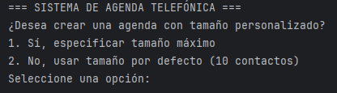
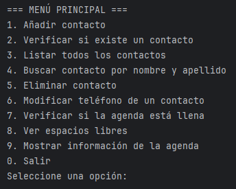
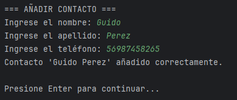
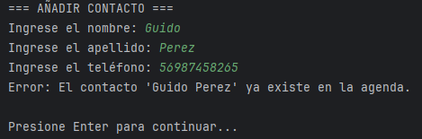
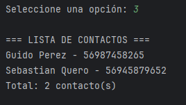

<h1 align="center" style="font-size: 2em; margin-bottom: 20px;">
  📞 Agenda Telefónica en Java 📞
</h1>

<h1 align="center" style="font-size: 2em; margin-bottom: 20px;">
👥 Integrantes del equipo 👥
</h1>

<table>
<tr>
<td>

## 👥 Equipo Q-ERO v3 Protocol

- Agustín Valenzuela
- Karim Valenzuela  
- Javier Valenzuela   
- Anita Morales  
- Nicolás Peña 
- Mauricio Narváez
- Vicente Díaz

</td>
<td align="center" valign="middle" width="320">
  
</td
</tr>
</table>

## 📋 Descripción del Proyecto
Este proyecto implementa un sistema completo de gestión de agenda telefónica en **Java** que permite almacenar, consultar, modificar y eliminar contactos de manera eficiente.

El sistema está diseñado siguiendo principios de **programación orientada a objetos** y ofrece una **interfaz de consola interactiva** para su uso.

## 🏗️ Estructura del Proyecto

El sistema está compuesto por **tres clases principales**:

### 1️⃣ Contacto.java — Representa un contacto telefónico
**Atributos:**
- nombre  
- apellido  
- telefono  

**Funcionalidades:**
- Constructor con parámetros  
- Getters y setters  
- `equals()` sin distinguir mayúsculas/minúsculas  
- `hashCode()` consistente con `equals()`  
- `toString()` para representación en texto  

### 2️⃣ AgendaTelefonica.java — Gestión de contactos
**Estructura interna:**
- `HashSet<Contacto>`

**Características:**
- Constructor por defecto (10 contactos)  
- Constructor con capacidad personalizada  
- Validación de datos  
- Control de duplicados  
- Gestión de capacidad máxima  

### 3️⃣ SistemaAgendaTelefonica.java — Interfaz de consola
**Interfaz:**
- Menú interactivo con 10 opciones  

**Funciones:**
- Coordina todas las operaciones del sistema  

## 🎯 Funcionalidades Implementadas

### ✅ Validaciones y Restricciones
- Nombre y apellido no pueden estar vacíos  
- No se permiten contactos duplicados  
- Control de capacidad máxima  
- Comparación sin distinguir mayúsculas/minúsculas  

## 📋 Operaciones Disponibles

| Opción | Función | Descripción |
|------:|--------|-------------|
| 1 | Añadir contacto | Agrega un nuevo contacto |
| 2 | Verificar existencia | Comprueba si un contacto existe |
| 3 | Listar contactos | Muestra contactos ordenados |
| 4 | Buscar contacto | Muestra el teléfono |
| 5 | Eliminar contacto | Elimina un contacto |
| 6 | Modificar teléfono | Cambia el número |
| 7 | Verificar si está llena | Estado de capacidad |
| 8 | Ver espacios libres | Contactos disponibles |
| 9 | Información de agenda | Estadísticas |
| 0 | Salir | Termina la aplicación |

## 🔧 Características Técnicas

### 🎨 Diseño Orientado a Objetos
- Encapsulación  
- Sobreescritura de métodos  
- Alta cohesión  

### 🔍 Estructuras de Datos
- `HashSet` para control de duplicados  
- `ArrayList + Comparator` para ordenamiento  
- Búsqueda O(1) promedio  

## 📸 Screenshot 1 - Agenda Personalizada o por Defecto

## 📸 Screenshot 2 - Menú

## 📸 Screenshot 3 - Agregar Contacto

## 📸 Screenshot 4 - Ver Duplicados

## 📸 Screenshot 5 - Ver todos los Contactos

